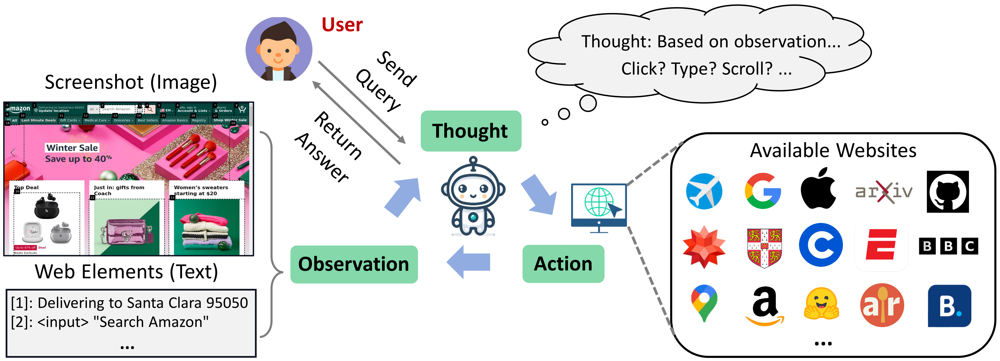
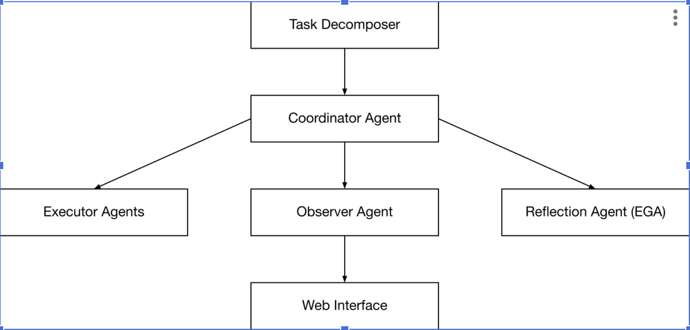

<div align="center">
<h1> WebVoyager 

<br> Building an End-to-End Web Agent with Large Multimodal Models </h1>
</div>

<div align="center">


</div>

<div align="center">

</div>


## Assignment 2: USD to IDR Exchange Rate Retrieval with Agentic AI

This project extends WebVoyager to showcase a working **multi-agent + reflection** system for extracting the **exchange rate from USD to IDR** using OpenAI GPT models. The system features:

- 🤖 Multi-Agent design with specialized roles (Executor, Observer, Reflection, Orchestrator)
- 🔁 Error Grounding Agent (EGA) to fix mistakes and revise strategies
- 🌐 Web automation using Selenium and undetected-chromedriver

---

## 💡 Example Task

```json
{"web_name": "Exchange Rate - XE", "id": "usd_to_idr_xe", "ques": "Find the exchange rate from USD (From) to IDR (To).", "web": "https://www.xe.com/currencyconverter/"}
```

The agent will select the correct dropdown, type "IDR" to filter, and extract the exchange result. Final action:

> `ANSWER; The exchange rate from USD to IDR is 15,303 Indonesian Rupiahs per 1 USD.`

---

## 🧠 System Architecture



- **Task Decomposer**: Breaks high-level goals into subtasks
- **Coordinator Agent**: Decides which agent to activate next
- **Executor Agent**: Executes low-level actions like click, scroll, type
- **Observer Agent**: Captures screenshot or accessibility tree
- **Reflection Agent (EGA)**: Evaluates errors and offers strategy correction

---

## 🔁 Improvements over Assignment 1

- Assignment 1 failed to reliably interact with complex dropdowns or dismiss modals.
- Assignment 2 adds reflection and agent roles that adaptively retry with search inputs or scroll instead of repeating failed clicks.
- The architecture supports visibility issues and pop-up handling like cookie dialogs.

---

## ▶️ Running the Agent

```bash
bash run.sh
```

Modify the following:
- Update API key in `run.sh`
- Edit `data/tasks_test.jsonl` for your specific task

---

## 📦 Setup

```bash
conda create -n webvoyager python=3.10
conda activate webvoyager
pip install -r requirements.txt
```

---

## 📄 File Overview

| File | Description |
|------|-------------|
| `run.py` | Main execution logic |
| `prompts.py` | System prompts for planner and agents |
| `utils.py` | Helper functions for screenshots, messages, etc. |
| `utils_webarena.py` | Functions for extracting accessibility trees |
| `data/tasks_test.jsonl` | Task definition in JSONL |

---

## 📈 Example Output Log

```
Thought The "To" currency is currently set to EUR, so I need to change it to IDR. I will interact with the dropdown to change the "To" currency.
Action Click [19]
...
Thought The text input for the currency search is visible. I will type "IDR" to find the Indonesian Rupiah quickly.
Action Type [19]; IDR
...
Thought The exchange rate is now visible. I will extract the rate from USD to IDR shown on the page.
Action ANSWER; 1 USD = 16,807.19 Indonesian Rupiah (IDR).
```

---

## 📍 Notes

- Tested with GPT-4o (`--api_model gpt-4o`)
- You may run in `--headless` mode for faster background execution

---

## ✍️ Student Information
```
Slametian Dewa Tegar Perkasa 石柏楷 - 113527602
International Graduate Program in AI
National Central University (NCU)
Taiwan

GitHub: https://github.com/dewa-ai/assignment2-agenticai
```